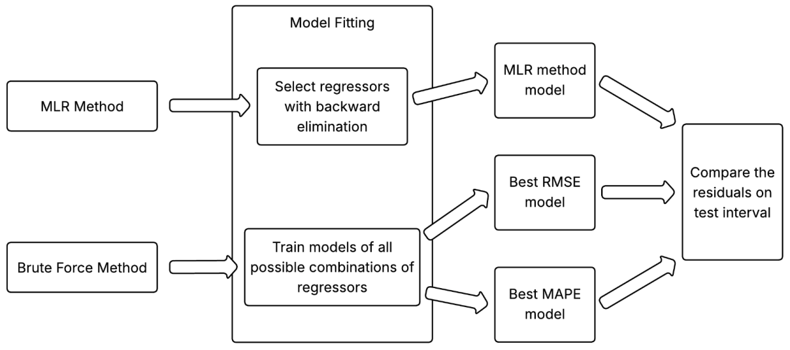
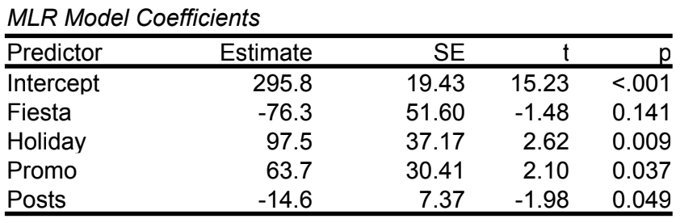
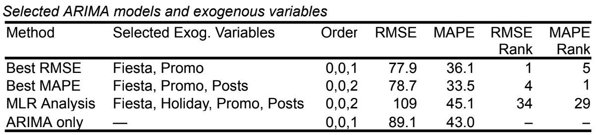
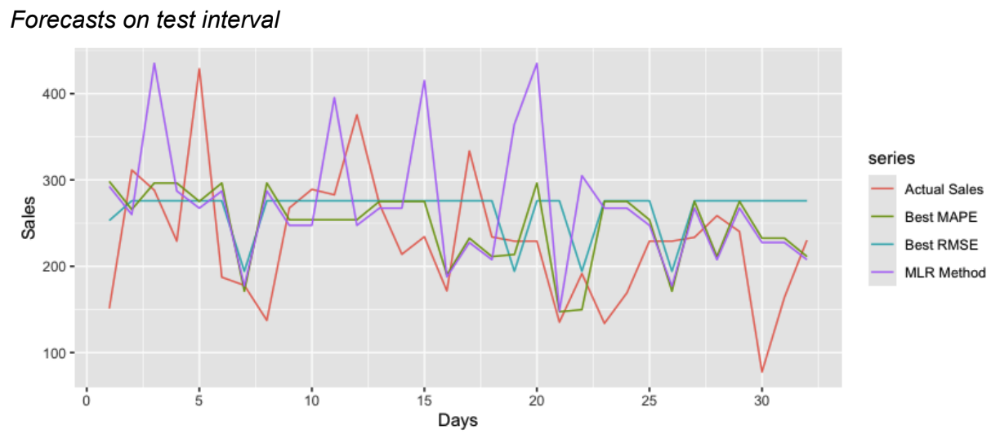
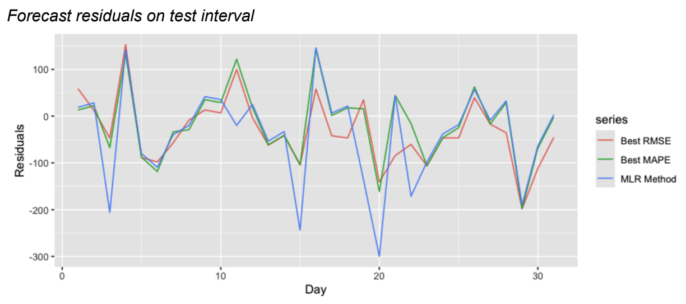
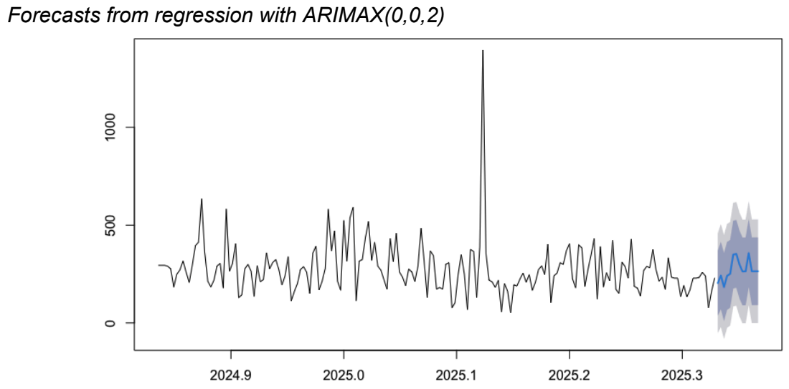
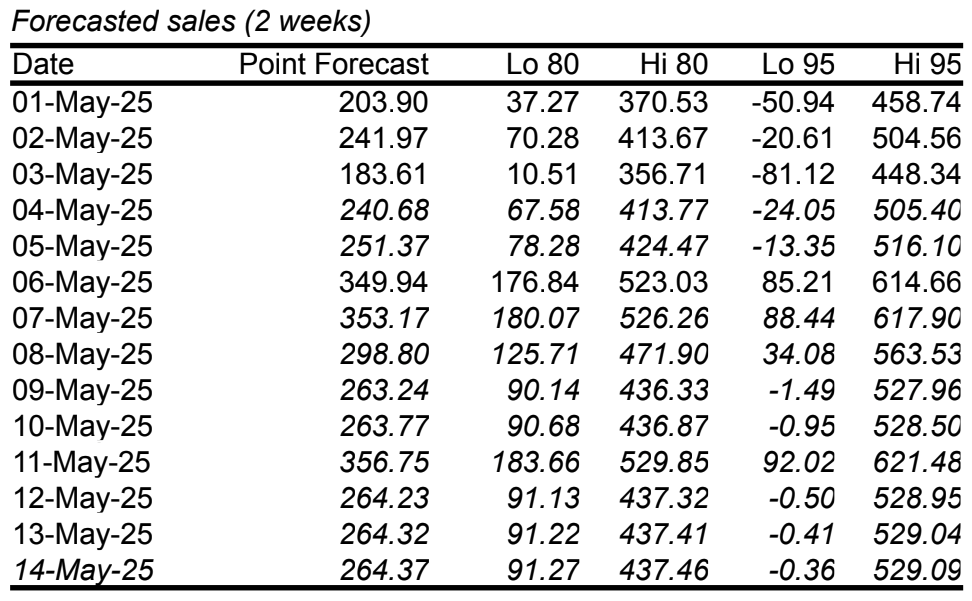
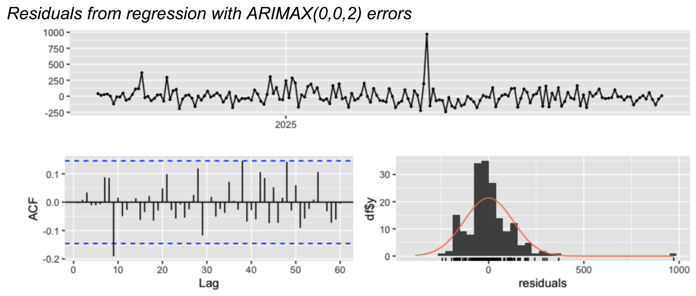

# Daily Sales Forecasting using ARIMAX with MLR Analysis as Possible Feature Selection on Regressors

This project forecasts daily sales of a local café based on 3 months of POS data.

It also investigates other factors as possible exogenous variables or regressors, including: Social media views (Views), Social media posts (Posts), Product promotions (Promo), Temperature (Temp), Local festivals and events (Fiesta), Holidays (Holiday), Class or work suspensions (Suspension).

A brute force method was implemented, trying all possible combinations of regressors simultaneous to the model fitting phase with the use of R's auto ARIMA function. To further investigate, MLR Analysis and backward elimination was used to select the possible regressors in creating an ARIMAX model.

Three ARIMAX models are then shortlisted: Best RMSE, Best MAPE, and MLR Method. Afterwards, the final model is selected via visual comparison and intuition.

## Project Overview

This project contains:

-   Time-series analysis (splitting the data by train set and test set)

-   ARIMA baseline model

-   MLR analysis and backward elimination

-   Brute force feature selection for ARIMAX

-   Best model evaluation and comparison using RMSE/MAPE

-   Forecasting of selected exogenous variables (if necessary)

-   Final 14-day ARIMAX forecast of daily sales

## Project Framework

The diagram below shows the framework in selecting the best model and its regressors.

## Tools and Software Used

-   Microsoft Excel - for data cleaning

-   Jamovi - for MLR Analysis and Backward Elimination

-   RStudio - for ARIMA and ARIMAX modeling

## Brief Result and Discussion

The goal is to shortlist three possible models.

From MLR analysis and backward selection, factors with p-values \<0.05 were selected (Holiday, Promo, Posts). Fiesta was also included as removing it would continuously eliminate all the other factors, leading to none.

The table below shows all the shortlisted models and their regressors. The ARIMA baseline model was also included for reference. The MLR method model is now eliminated, as it only ranked 34th in RMSE and 29th in MAPE. Visual graphs and interpretations are then needed to choose between RMSE and MAPE.

The graph below shows all the models' forecasts compared to the actual sales.

To take a step closer to the goal of choosing the best model, a graph of residuals was essential, provided below. However, both Best RMSE and Best MAPE models are in close competition, ultimately having to resort in arbitrary choosing. Based entirely on intuition, Best MAPE model was chosen as it felt closer to zero between days 15 and 25. Regardless, either models can be chosen.

As the model ARIMAX(0,0,2) with regressors Fiesta, Promo, and Posts was selected, the forecast table and graph are shown below.

### Additional Evaluation

Below is the residual analysis of the final ARIMAX model. It shows no clear autocorrelation among residuals, indicating that the model has adequately fitted with the time series data of sales.

## Conclusion

From the final selected model, it proposes that factors like local festivals, product and service promotions, and the number of social media posts per day can affect sales.

This project also proposes that MLR Analysis and Backward Elimination can shortlist the significant regressors, with the final model possessing 3/4 of the MLR Method model's regressors. Further investigation for this hypothesis.

## Author

**Zak Laurence E. Beltran**

Mathematics and Computer Science Student
